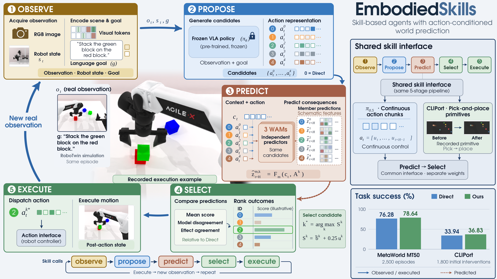
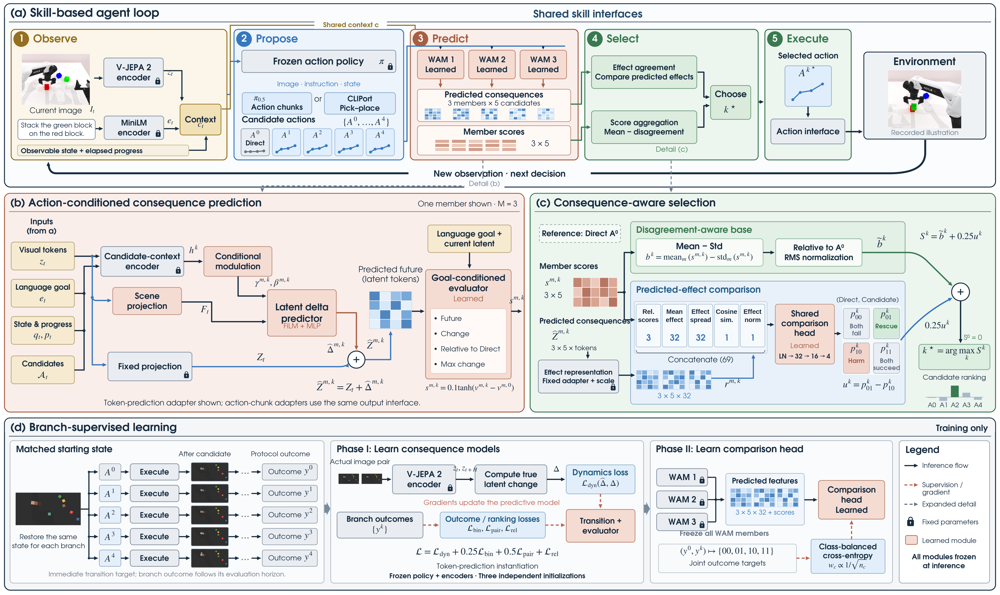
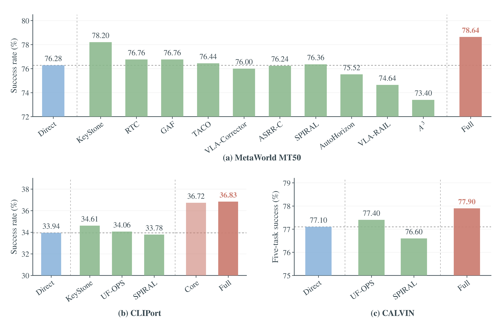

<div align="center">

# EmbodiedSkills

### World Action Model-augmented Cascaded Skills for Vision-Language-Action Agent

[Project page](https://zju4embodiedai.github.io/EmbodiedSkills/) · [Paper](https://arxiv.org/abs/2609.01281) · [Architecture](#architecture) · [Training](#training) · [Integration](docs/integration.md)

**Anticipate action consequences. Compare policy proposals. Execute through shared skills.**

</div>

<p align="center">
  
</p>

EmbodiedSkills augments frozen vision-language-action policies with predictive decision-making. Given a scene, a language instruction and a set of executable policy proposals, lightweight world action models anticipate the consequences of each candidate in a pretrained visual representation. A shared comparison head then combines outcome estimates, model disagreement and agreement in predicted effects to select the action to execute.

The framework organizes this process into five cascaded stages—**Observe, Propose, Predict, Select and Execute**—connected through reusable skill interfaces. Candidate identity is preserved throughout the cascade, allowing continuous control policies and spatial manipulation policies to participate in the same feedback loop. Adaptation is concentrated in the consequence models and comparison head; the action policy, visual backbone and language encoder remain frozen.

## Architecture

<p align="center">
  
</p>

An embodied skill implements an operation with defined inputs and outputs. Stages establish the information dependencies between these operations, while backend adapters supply their implementations.

| Stage | Skills | Output |
| :--- | :--- | :--- |
| **Observe** | Scene observation and context encoding | Visual features, instruction embedding, observable state and elapsed progress |
| **Propose** | Frozen-policy candidate generation | Five executable actions, with the direct proposal at index zero |
| **Predict** | Consequence prediction and outcome evaluation | Candidate-conditioned latent forecasts and scores from three independent WAMs |
| **Select** | Predicted-effect comparison and score aggregation | One index into the original candidate set |
| **Execute** | Native action dispatch | Environment feedback for the next decision |

The release includes two consequence-model implementations. The **spatial model** conditions a token-level latent transition on candidate-context features and evaluates its predicted effect against the language goal. The **continuous model** encodes action chunks recurrently and predicts a pooled future visual representation. Both feed the same form of candidate-relative comparison. Frozen V-JEPA 2 and MiniLM provide the default observation representations.

### Consequence-aware selection

Three independently trained WAM members evaluate the same five proposals. Their mean outcome score is discounted by the population standard deviation, then expressed relative to the direct proposal and normalized within the candidate set. A lightweight comparator receives a 69-dimensional descriptor containing member scores, the mean and spread of predicted effects, directional agreement and effect magnitude.

The comparator estimates four joint outcomes for the direct proposal and each alternative: both fail, only the alternative succeeds, only the direct proposal succeeds, and both succeed. The final score combines the normalized ensemble estimate with the predicted benefit of replacement:

```math
S^k = \widetilde{b}^k + 0.25 (p_{01}^k - p_{10}^k),
\qquad k^\star = \arg\max_k S^k.
```

The direct candidate has score zero, and ties follow candidate order. Comparison operates entirely on predicted consequences and model scores. The selected action retains its original representation and is dispatched to the frozen policy's execution backend.

### Branch-supervised learning

Supervision comes from executing alternative candidates from matched starting states. The observation after each candidate provides a latent transition target; recorded branch outcomes provide action-quality supervision. The spatial model learns dynamics first, followed by joint consequence prediction and goal-conditioned evaluation. Continuous-action training additionally supports branch returns and expert-alignment targets.

Once the three WAM members are trained, they are frozen and the comparison head learns the four joint outcome classes. Training uses task-balanced sampling, training-fitted feature statistics and an episode-disjoint validation partition. Future observations and recorded outcomes enter the learning objectives; deployed inference consumes the current context and proposed actions.

## Results

The paper evaluates consequence-aware policy augmentation across continuous control, spatial manipulation and long-horizon task chains.

<p align="center">
  
</p>

| Benchmark | Frozen policy | Direct policy | EmbodiedSkills | Gain |
| :--- | :--- | ---: | ---: | ---: |
| MetaWorld MT50 | π₀.₅ | 76.28% | **78.64%** | +2.36 pp |
| CLIPort | CLIPort | 33.94% | **36.83%** | +2.89 pp |
| CALVIN | FLOWER | 77.10% | **77.90%** | +0.80 pp |

MetaWorld and CLIPort report complete-task success; CALVIN reports completion of all five tasks in a chain. The paper describes the benchmark-specific proposal and intervention protocols. The training presets in this repository cover the spatial and continuous core models.

## Installation

Use Python 3.10 or newer and install a PyTorch build compatible with your CUDA driver. The core also runs on CPU.

```bash
git clone https://github.com/ZJU4EmbodiedAI/EmbodiedSkills.git
cd EmbodiedSkills
pip install -e .
```

For RGB and language feature extraction:

```bash
pip install -e '.[encoders]'
```

Download the visual and language encoders before feature extraction. The default configuration uses `facebook/vjepa2-vitl-fpc64-256` and `sentence-transformers/all-MiniLM-L6-v2`. Encoder loading uses local model files or the Hugging Face cache. Benchmark environments, frozen action policies and their checkpoints are installed separately in their upstream environments.

## Training

Training operates on feature archives containing aligned observations, policy candidates and branch supervision. The [data specification](docs/data.md) defines the fields, action representations and split requirements.

```bash
# Spatial candidate-conditioned WAMs and consensus head
embodiedskills train \
  --config configs/spatial.yaml \
  --train data/spatial_train.npz \
  --validation data/spatial_validation.npz \
  --output outputs/spatial \
  --device cuda:0

# Continuous action-chunk WAMs and consensus head
embodiedskills train \
  --config configs/continuous.yaml \
  --train data/continuous_train.npz \
  --validation data/continuous_validation.npz \
  --output outputs/continuous \
  --device cuda:0
```

Each command trains three WAM members and then the shared comparison head. Spatial training first learns the candidate-context encoder; an existing compatible encoder can be supplied with `--context-checkpoint`. Epochs, batch sizes, initialization seeds and action dimensions are configured in YAML. Dataset sizes are inferred from the input archives.

The resulting `selector.pt` is a self-contained bundle of all three members, the comparison head and their normalization statistics. It can be moved between machines independently of the training directory. Visual and language backbone weights remain external.

## Inference and evaluation

For feature-based inference, the selector accepts only the current visual representation, observable state, instruction embedding, elapsed progress and candidate actions:

```python
from embodiedskills.runtime import Selector

selector = Selector("outputs/spatial/selector.pt", device="cuda:0")
result = selector.predict(
    visual=current_visual_features,
    state=observable_state,
    language=instruction_features,
    progress=elapsed_progress,
    actions=candidate_actions,
)
selected_indices = result["selected"]
```

All inputs have a leading batch dimension. For continuous actions, an optional binary `mask` specifies valid steps in each chunk. [Integration examples](docs/integration.md) describe native action encodings, policy sampling and the shared execution loop.

Cached-branch evaluation selects candidates from current inputs, then joins the recorded outcomes to compute aggregate and per-task success, rescues, harms and intervention counts:

```bash
embodiedskills evaluate \
  --checkpoint outputs/spatial/selector.pt \
  --input data/spatial_test.npz \
  --output outputs/spatial_test.json \
  --device cuda:0
```

The command evaluates the supplied recorded branches. Online closed-loop evaluation uses `run_loop` with a policy and environment adapter, collecting fresh observations after execution. Evaluation size follows the archive or the caller's episode list; `--limit` optionally restricts a cached evaluation.

## Repository

```text
configs/                    Spatial and continuous training presets
docs/                       Data contracts, integration guide and architecture figure
src/embodiedskills/
  spatial.py                Spatial context, latent transition and goal-conditioned value
  continuous.py             Recurrent action-chunk consequence model
  consensus.py              Spatial predicted-effect comparison
  continuous_consensus.py   Pooled-effect projection and comparison
  vision.py, language.py    Frozen observation encoders
  adapters.py, sampling.py  Native action representations and proposal generation helpers
  runtime.py                Shared skill interface and decision loop
  training.py, losses.py    WAM and comparator learning
  checkpoint.py             Portable model bundles
  migration.py              Conversion of compatible research checkpoints
  data.py, cli.py           Feature archives and command-line entry points
```

The repository contains the model and runtime source, training configurations and usage documentation. Datasets, pretrained weights and generated run artifacts are stored outside the release tree.

## Citation

```bibtex
@article{wang2026embodiedskills,
  title={EmbodiedSkills: World Action Model-augmented Cascaded Skills for Vision-Language-Action Agent},
  author={Wang, Wei and Zhang, Wenqiao and Lin, Yutong and Yuan, Yuqian and Lin, Tianwei
          and Mao, Jinhao and Fan, Zhenxuan and Gao, Mingjian and Dai, Yang and Li, Wentong
          and Lv, Zheqi and Dong, Zheng and Niu, Yingjie and Zhu, Jiaqi and Xiao, Jun
          and Li, Chao and Zhuang, Yueting},
  journal={arXiv preprint arXiv:2609.01281},
  year={2026}
}
```
